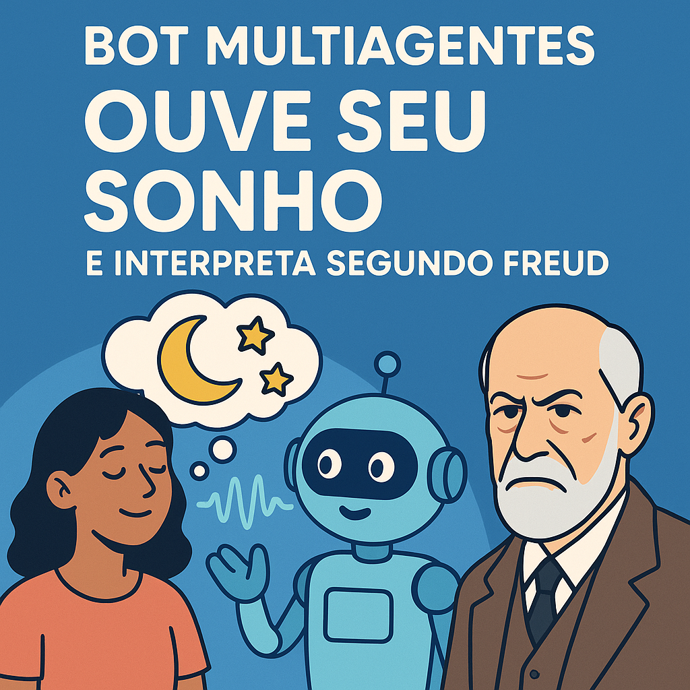

# 🤖 Bot Dreams - Interprete seus sonhos com Freud  
Projeto criado durante a **Imersão Alura + Google Gemini**.

## 🧠 Sobre o projeto  
O **Bot Dreams** é uma aplicação experimental que simula um analista freudiano virtual. 
Com o uso de múltiplos agentes da API do Google Gemini, o bot recebe descrições de sonhos e oferece interpretações baseadas em conceitos da psicanálise freudiana.

A proposta é criar uma experiência interativa e curiosa, permitindo que o usuário compartilhe um sonho e receba uma análise inspirada nas ideias de Sigmund Freud sobre o inconsciente, 
os desejos reprimidos, simbolismos e mecanismos de defesa.

## ✨ Funcionalidades  
- Interface de chat com o bot.
- Envio de descrições de sonhos pelo usuário.
- Interpretação automatizada baseada na psicanálise.
- Respostas geradas por múltiplos agentes com papéis definidos.

